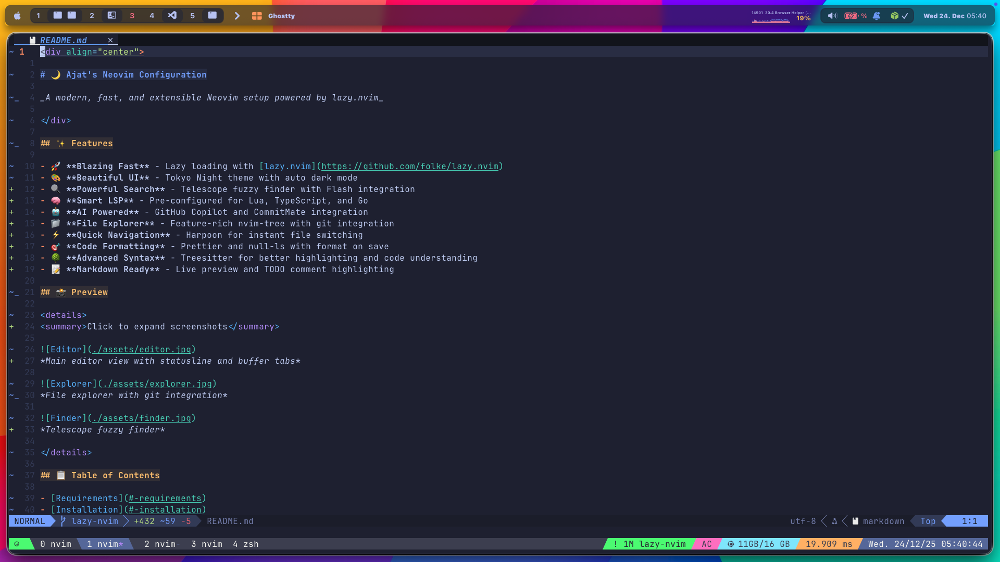
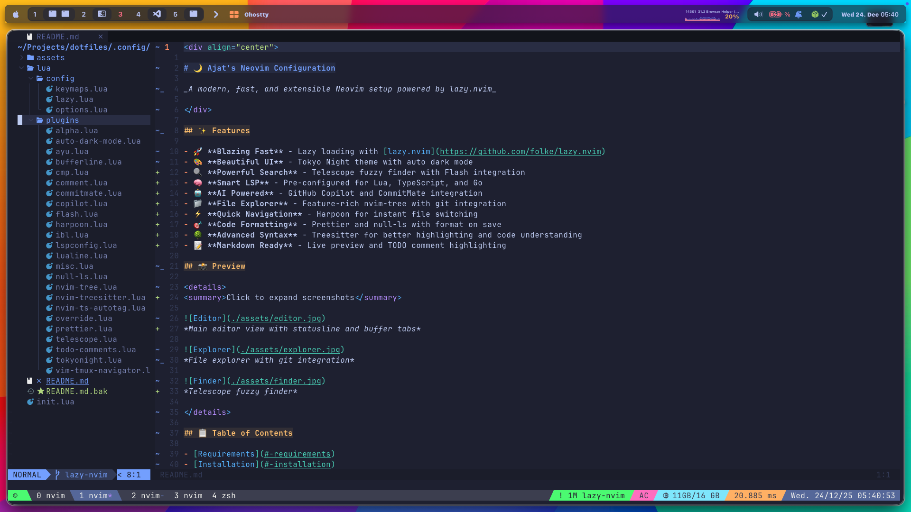
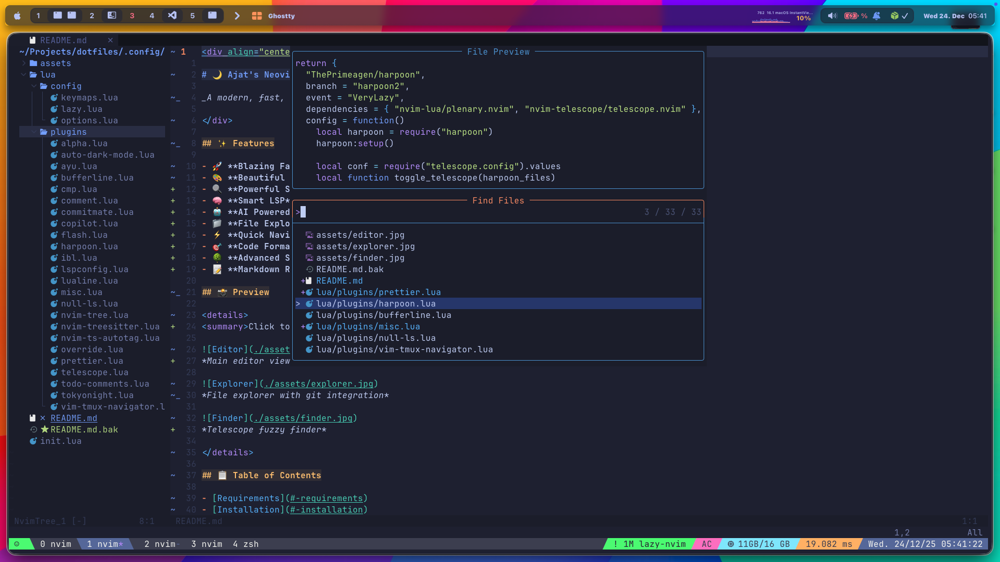
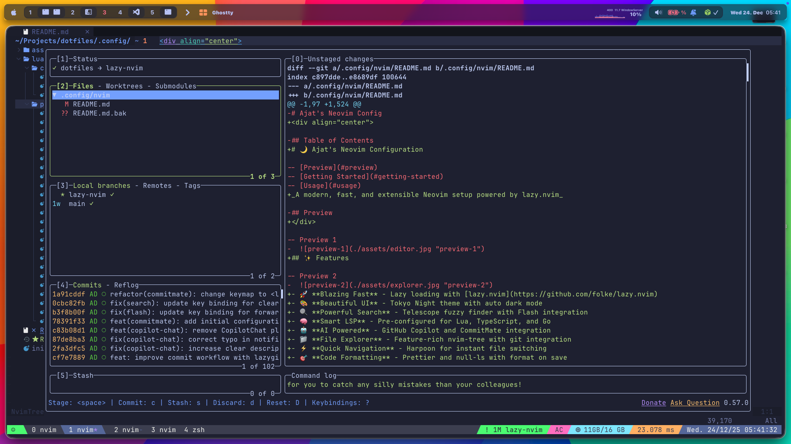

<div align="center">

# 🌙 Ajat's Neovim Configuration

_A modern, fast, and extensible Neovim setup powered by lazy.nvim_

</div>

## ✨ Features

- 🚀 **Blazing Fast** - Lazy loading with [lazy.nvim](https://github.com/folke/lazy.nvim)
- 🎨 **Beautiful UI** - Tokyo Night theme with auto dark mode
- 🔍 **Powerful Search** - Telescope fuzzy finder with Flash integration
- 🧠 **Smart LSP** - Pre-configured for Lua, TypeScript, and Go
- 🤖 **AI Powered** - GitHub Copilot and CommitMate integration
- 📁 **File Explorer** - Feature-rich nvim-tree with git integration
- ⚡ **Quick Navigation** - Harpoon for instant file switching
- 🎯 **Code Formatting** - Prettier and null-ls with format on save
- 🌳 **Advanced Syntax** - Treesitter for better highlighting and code understanding
- 📝 **Markdown Ready** - Live preview and TODO comment highlighting

## 📸 Preview

<details>
<summary>Click to expand screenshots</summary>


*Main editor view with statusline and buffer tabs*


*File explorer with git integration*


*Telescope fuzzy finder*


*LazyGit integration for version control*

</details>

## 📋 Table of Contents

- [Requirements](#-requirements)
- [Installation](#-installation)
- [File Structure](#-file-structure)
- [Keybindings](#-keybindings)
- [Plugins](#-plugins)
- [Configuration](#-configuration)

## 📦 Requirements

### Required

- [Neovim](https://neovim.io/) >= 0.9.0
- [Git](https://git-scm.com/) >= 2.19.0
- [ripgrep](https://github.com/BurntSushi/ripgrep) - For Telescope live grep
- [Node.js](https://nodejs.org/) >= 16.0.0 - For LSP servers
- A [Nerd Font](https://www.nerdfonts.com/) - For icons (recommended: [Hack Nerd Font](https://github.com/ryanoasis/nerd-fonts/releases/download/v3.2.1/Hack.zip))

### Optional

- [fd](https://github.com/sharkdp/fd) - For faster file finding
- [lazygit](https://github.com/jesseduffield/lazygit) - For git TUI
- [prettierd](https://github.com/fsouza/prettierd) - For faster formatting

## 🚀 Installation

### 1. Backup Existing Config

```bash
mv ~/.config/nvim ~/.config/nvim.bak
mv ~/.local/share/nvim ~/.local/share/nvim.bak
```

### 2. Clone Dotfiles Repository

```bash
git clone https://github.com/ajatdarojat45/dotfiles.git ~/dotfiles
```

### 3. Symlink Neovim Config

```bash
ln -s ~/dotfiles/.config/nvim ~/.config/nvim
```

Or if you prefer to copy instead of symlink:

```bash
cp -r ~/dotfiles/.config/nvim ~/.config/nvim
```

### 4. Launch Neovim

```bash
nvim
```

On first launch, lazy.nvim will automatically bootstrap and install all plugins.

### 5. Post-Installation (Optional)

**Install Treesitter parsers:**
```vim
:TSInstall <language>
```

**Install Markdown Preview:**
```vim
:call mkdp#util#install()
```

**Check LSP installations:**
```vim
:Mason
```

## 📁 File Structure

```
~/.config/nvim/
├── init.lua                    # Main entry point
├── lazy-lock.json             # Plugin version lock file
├── lua/
│   ├── config/
│   │   ├── keymaps.lua       # Key mappings
│   │   ├── lazy.lua          # Plugin manager setup
│   │   └── options.lua       # Editor options
│   └── plugins/
│       ├── alpha.lua         # Startup screen
│       ├── auto-dark-mode.lua
│       ├── bufferline.lua    # Buffer tabs
│       ├── cmp.lua           # Completion
│       ├── comment.lua       # Code commenting
│       ├── commitmate.lua    # AI commit messages
│       ├── copilot.lua       # GitHub Copilot
│       ├── flash.lua         # Quick navigation
│       ├── harpoon.lua       # File bookmarks
│       ├── ibl.lua           # Indent guides
│       ├── lspconfig.lua     # LSP configuration
│       ├── lualine.lua       # Statusline
│       ├── misc.lua          # Miscellaneous plugins
│       ├── null-ls.lua       # Formatting & linting
│       ├── nvim-tree.lua     # File explorer
│       ├── nvim-treesitter.lua
│       ├── nvim-ts-autotag.lua
│       ├── prettier.lua      # Code formatter
│       ├── telescope.lua     # Fuzzy finder
│       ├── todo-comments.lua
│       ├── tokyonight.lua    # Color scheme
│       └── vim-tmux-navigator.lua
└── assets/                   # Screenshots
```

## ⌨️ Keybindings

> **Leader key is `Space`**

### General

| Mapping | Action | Mode |
|---------|--------|------|
| `jj` | Exit insert mode | Insert |
| `leader` + `w` | Save file | Normal |
| `leader` + `s` | Save file (force) | Normal |
| `leader` + `q` | Quit | Normal |
| `leader` + `wq` | Save and quit | Normal |
| `leader` + `qq` | Quit all (force) | Normal |

### Buffer Navigation

| Mapping | Action | Mode |
|---------|--------|------|
| `Shift` + `h` | Previous buffer | Normal |
| `Shift` + `l` | Next buffer | Normal |
| `Shift` + `k` | First buffer | Normal |
| `Shift` + `j` | Last buffer | Normal |
| `Shift` + `r` | Remove current buffer | Normal |
| `leader` + `bd` | Close all buffers | Normal |

### Text Operations

| Mapping | Action | Mode |
|---------|--------|------|
| `o` | Open line below (stay in normal) | Normal |
| `O` | Open line above (stay in normal) | Normal |
| `ds` | Delete from cursor to line start | Normal |
| `ys` | Yank from cursor to line start | Normal |
| `leader` + `dd` | Delete entire file | Normal |
| `leader` + `yy` | Yank entire file | Normal |
| `leader` + `Y` | Copy entire file to system clipboard | Normal |
| `leader` + `y` | Copy to system clipboard | Normal/Visual |
| `leader` + `p` | Paste without overwriting clipboard | Visual |
| `leader` + `h` | Move to line start | Normal |
| `leader` + `l` | Move to line end | Normal |

### Visual Mode

| Mapping | Action | Mode |
|---------|--------|------|
| `<` | Unindent (stay in visual) | Visual |
| `>` | Indent (stay in visual) | Visual |
| `J` | Move line down | Visual |
| `K` | Move line up | Visual |

### Search & Navigation

| Mapping | Action | Mode |
|---------|--------|------|
| `leader` + `/` | Clear search highlight | Normal |
| `n` | Next search result (centered) | Normal |
| `N` | Previous search result (centered) | Normal |
| `leader` + `fl` | Flash forward search | Normal |
| `leader` + `?` | Flash reverse search | Normal |

### Code Editing

| Mapping | Action | Mode |
|---------|--------|------|
| `u` | Undo | Normal |
| `r` | Redo | Normal |
| `leader` + `cc` | Toggle line comment | Normal |
| `leader` + `f` | Format with LSP/null-ls | Normal |
| `leader` + `sf` | Format with Prettier and save | Normal |

### LSP

| Mapping | Action | Mode |
|---------|--------|------|
| `gd` | Go to definition | Normal |
| `gD` | Go to declaration | Normal |
| `gi` | Go to implementation | Normal |
| `go` | Go to type definition | Normal |
| `gr` | Show references | Normal |
| `gs` | Show signature help | Normal |
| `ch` | Show hover (focus float) | Normal |
| `cr` | Rename symbol | Normal |
| `cf` | Format code | Normal |
| `ca` | Code actions | Normal |
| `cd` | Show diagnostics (focus float) | Normal |
| `leader` + `d` | Show hover documentation | Normal |

### Treesitter

| Mapping | Action | Mode |
|---------|--------|------|
| `gnn` | Init treesitter selection | Normal |
| `grn` | Increment node selection | Visual |
| `grm` | Decrement node selection | Visual |
| `grc` | Increment scope selection | Visual |

### Folding

| Mapping | Action | Mode |
|---------|--------|------|
| `za` | Toggle fold | Normal |
| `zc` | Close fold | Normal |
| `zo` | Open fold | Normal |
| `zM` | Close all folds | Normal |
| `zR` | Open all folds | Normal |

### File Explorer (NvimTree)

| Mapping | Action | Mode |
|---------|--------|------|
| `leader` + `e` | Focus file explorer | Normal |
| `leader` + `ee` | Toggle file explorer | Normal |
| `leader` + `er` | Refresh file explorer | Normal |
| `leader` + `ef` | Find current file in tree | Normal |
| `a` | Create file/folder | NvimTree |
| `c` | Copy | NvimTree |
| `x` | Cut | NvimTree |
| `p` | Paste | NvimTree |
| `r` | Rename | NvimTree |
| `d` | Delete | NvimTree |

### Telescope

| Mapping | Action | Mode |
|---------|--------|------|
| `leader` + `ff` | Find files | Normal |
| `leader` + `fg` | Live grep (search text) | Normal |
| `leader` + `fb` | Find buffers | Normal |
| `leader` + `fh` | Help tags | Normal |
| `leader` + `fc` | Color schemes | Normal |
| `Shift` + `q` | Close telescope | Normal/Insert |
| `Shift` + `d` | Delete buffer from list | Normal/Insert |

### Harpoon

| Mapping | Action | Mode |
|---------|--------|------|
| `Ctrl` + `p` | Add file to harpoon | Normal |
| `Ctrl` + `e` | Toggle harpoon menu | Normal |
| `Ctrl` + `h` | Go to harpoon file 1 | Normal |
| `Ctrl` + `t` | Go to harpoon file 2 | Normal |
| `Ctrl` + `n` | Go to harpoon file 3 | Normal |
| `Ctrl` + `s` | Go to harpoon file 4 | Normal |
| `Ctrl` + `Shift` + `p` | Previous harpoon file | Normal |
| `Ctrl` + `Shift` + `n` | Next harpoon file | Normal |

### Tmux Navigation

| Mapping | Action | Mode |
|---------|--------|------|
| `Ctrl` + `h` | Navigate left | Normal |
| `Ctrl` + `j` | Navigate down | Normal |
| `Ctrl` + `k` | Navigate up | Normal |
| `Ctrl` + `l` | Navigate right | Normal |
| `Ctrl` + `\` | Navigate to previous | Normal |

### Git

| Mapping | Action | Mode |
|---------|--------|------|
| `leader` + `gg` | Open LazyGit | Normal |
| `leader` + `cm` | Generate AI commit message | Normal |

### Markdown

| Mapping | Action | Mode |
|---------|--------|------|
| `mp` | Open Markdown preview | Normal |

### Copilot

| Mapping | Action | Mode |
|---------|--------|------|
| `Ctrl` + `j` | Accept Copilot suggestion | Insert |

### Completion (nvim-cmp)

| Mapping | Action | Mode |
|---------|--------|------|
| `Ctrl` + `Space` | Trigger completion | Insert |
| `Tab` | Select next item | Insert |
| `Shift` + `Tab` | Select previous item | Insert |
| `Enter` | Confirm selection | Insert |
| `Ctrl` + `e` | Close completion menu | Insert |
| `Ctrl` + `b` | Scroll docs up | Insert |
| `Ctrl` + `f` | Scroll docs down | Insert |

## 🔌 Plugins

This configuration uses [lazy.nvim](https://github.com/folke/lazy.nvim) for plugin management.

### LSP & Completion

| Plugin | Description |
|--------|-------------|
| [nvim-lspconfig](https://github.com/neovim/nvim-lspconfig) | LSP configuration with Mason integration |
| [mason.nvim](https://github.com/williamboman/mason.nvim) | Package manager for LSP/DAP/linters/formatters |
| [nvim-cmp](https://github.com/hrsh7th/nvim-cmp) | Autocompletion engine with multiple sources |
| [LuaSnip](https://github.com/L3MON4D3/LuaSnip) | Snippet engine |

**Pre-installed Language Servers:** `lua_ls`, `ts_ls`, `gopls`

### Syntax Highlighting

| Plugin | Description |
|--------|-------------|
| [nvim-treesitter](https://github.com/nvim-treesitter/nvim-treesitter) | Advanced syntax highlighting and code understanding |
| [nvim-ts-autotag](https://github.com/windwp/nvim-ts-autotag) | Auto close and rename HTML/JSX tags |

**Pre-installed Parsers:** bash, css, dockerfile, go, html, javascript, json, lua, markdown, php, python, typescript, yaml, and more

### File Explorer & Fuzzy Finding

| Plugin | Description |
|--------|-------------|
| [nvim-tree.lua](https://github.com/nvim-tree/nvim-tree.lua) | File explorer with git integration |
| [telescope.nvim](https://github.com/nvim-telescope/telescope.nvim) | Fuzzy finder over lists |
| [harpoon](https://github.com/ThePrimeagen/harpoon) (v2) | Quick file navigation and bookmarks |
| [flash.nvim](https://github.com/folke/flash.nvim) | Navigate with search labels |

### UI & Aesthetics

| Plugin | Description |
|--------|-------------|
| [tokyonight.nvim](https://github.com/folke/tokyonight.nvim) | Default colorscheme (moon variant) |
| [auto-dark-mode.nvim](https://github.com/f-person/auto-dark-mode.nvim) | Auto-switch between light/dark themes |
| [lualine.nvim](https://github.com/nvim-lualine/lualine.nvim) | Fast and customizable statusline |
| [bufferline.nvim](https://github.com/akinsho/bufferline.nvim) | Buffer tabs with LSP diagnostics |
| [indent-blankline.nvim](https://github.com/lukas-reineke/indent-blankline.nvim) | Indent guides with scope highlighting |
| [alpha-nvim](https://github.com/goolord/alpha-nvim) | Customizable startup screen |
| [nvim-web-devicons](https://github.com/nvim-tree/nvim-web-devicons) | File type icons |

### Code Editing

| Plugin | Description |
|--------|-------------|
| [Comment.nvim](https://github.com/numToStr/Comment.nvim) | Smart and powerful comment toggling |
| [todo-comments.nvim](https://github.com/folke/todo-comments.nvim) | Highlight and search TODO comments |
| [delimitmate](https://github.com/raimondi/delimitmate) | Auto-close quotes, brackets, etc. |
| [vim-multiple-cursors](https://github.com/terryma/vim-multiple-cursors) | Multiple cursor support |

### Formatting & Linting

| Plugin | Description |
|--------|-------------|
| [prettier.nvim](https://github.com/MunifTanjim/prettier.nvim) | Prettier integration using prettierd |
| [none-ls.nvim](https://github.com/nvimtools/none-ls.nvim) | Format on save and diagnostics |

**Supported Languages:** CSS, HTML, JavaScript, TypeScript, JSON, Markdown, YAML, Go, Lua, and more

### Git Integration

| Plugin | Description |
|--------|-------------|
| [lazygit.nvim](https://github.com/kdheepak/lazygit.nvim) | LazyGit terminal UI integration |
| [vim-fugitive](https://github.com/tpope/vim-fugitive) | Git wrapper for vim commands |
| [vim-gitgutter](https://github.com/airblade/vim-gitgutter) | Git diff in the sign column |
| [commitmate.nvim](https://github.com/ajatdarojat45/commitmate.nvim) | AI-powered commit message generator |

### AI & Productivity

| Plugin | Description |
|--------|-------------|
| [copilot.vim](https://github.com/github/copilot.vim) | GitHub Copilot integration |
| [vim-wakatime](https://github.com/wakatime/vim-wakatime) | Automatic time tracking |

### Utilities

| Plugin | Description |
|--------|-------------|
| [vim-tmux-navigator](https://github.com/christoomey/vim-tmux-navigator) | Seamless tmux/vim navigation |
| [markdown-preview.nvim](https://github.com/iamcco/markdown-preview.nvim) | Live markdown preview in browser |
| [vim-mustache-handlebars](https://github.com/mustache/vim-mustache-handlebars) | Mustache/Handlebars syntax |
| [plenary.nvim](https://github.com/nvim-lua/plenary.nvim) | Lua utility functions |

## ⚙️ Configuration

### Editor Settings

```lua
-- Leader key
vim.g.mapleader = " "

-- Line numbers
opt.number = true
opt.relativenumber = true

-- Indentation
opt.tabstop = 2
opt.shiftwidth = 2
opt.expandtab = true
opt.smartindent = true

-- Clipboard
opt.clipboard = "unnamedplus"

-- Undo
opt.undofile = true
opt.undolevels = 10000

-- Folding
opt.foldenable = true
opt.foldmethod = "expr"
opt.foldexpr = "nvim_treesitter#foldexpr()"
opt.foldlevel = 99

-- Cursor
opt.guicursor = "n-v-c-sm:block,i-ci-ve:block-blinkon1,r-cr-o:block"

-- Other
opt.mouse = ""
opt.swapfile = false
opt.cursorline = true
opt.wrap = true
opt.linebreak = true
```

### LSP Servers

Configured via Mason, automatically installed on first setup:

- **lua_ls** - Lua language server
- **ts_ls** (formerly tsserver) - TypeScript/JavaScript
- **gopls** - Go language server

To install additional servers:
```vim
:Mason
```

### Treesitter Parsers

Auto-installed parsers: bash, css, dockerfile, go, html, javascript, json, lua, markdown, php, python, typescript, yaml, and more.

To manually install:
```vim
:TSInstall <parser_name>
```

### Color Schemes

**Active themes:**
- `tokyonight-moon` (default dark)
- `tokyonight-light` (auto-switched in light mode)
- `ayu` (lazy loaded)

To change themes manually:
```vim
:colorscheme tokyonight-storm
:colorscheme tokyonight-night
:colorscheme tokyonight-day
```

## 📝 Notes

- **Mouse is disabled** - Encourages keyboard-driven workflow
- **Swapfiles are disabled** - Uses `/tmp` directory instead
- **Format on save** - Enabled for most file types via null-ls
- **Lazy loading** - Most plugins load on-demand for faster startup
- **Git integration** - Requires `lazygit` binary for full functionality

## 🙏 Credits

Inspired by various Neovim configurations and the amazing plugin ecosystem. Special thanks to all plugin authors and the Neovim community.

---

<div align="center">

Made with ❤️ by [Ajat Darojat](https://github.com/ajatdarojat45)

</div>
