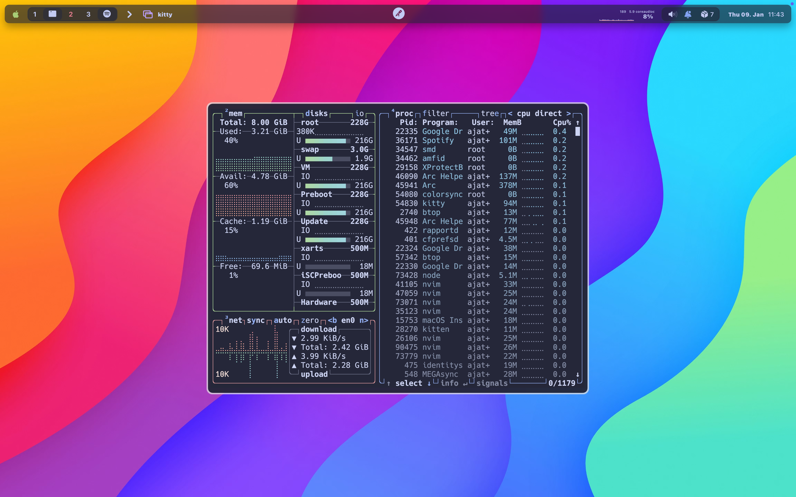

# Dotfiles (macOS)

Opinionated macOS setup and dotfiles managed via Homebrew, GNU Stow, and Oh My Zsh. The main entrypoint is the setup script, with optional installers for terminals, Neovim, databases, and SketchyBar.

## Preview



## Quick Start

Run the setup script. It will install Xcode CLI Tools (if missing), Homebrew, core formulae and casks, Oh My Zsh, stow your dotfiles, and start core services.

```bash
chmod +x setup.sh
# Add any optional flags you want, then run:
INSTALL_KITTY=true \
INSTALL_GHOSTTY=true \
INSTALL_ALACRITTY=true \
INSTALL_NVIM=true \
INSTALL_DATABASES=true \
INSTALL_SKETCHYBAR=true \
./setup.sh
```

You can omit any flags you don’t need. If Xcode CLI Tools are not installed, the script will prompt to install them and exit—rerun after the install finishes.

## What It Installs

- **Core tools:** skhd, sketchybar, borders, yabai, svim, stow, tmux, neovim, spaceship, zsh plugins (autosuggestions, syntax highlighting), git-open, zoxide, fzf, yazi, ffmpeg, jq, poppler, fd, ripgrep, imagemagick, btop, lazygit, mas, mysql-client@8.0, redis, postgresql, mongosh
- **Casks:** Arc, Raycast, Termius, DataGrip, OrbStack, Beekeeper Studio, Zoom, Discord, MEGAsync, Google Drive, InstantView, Time Out, SF Symbols, Hack Nerd Font
- **Mac App Store:** Meeter, Magnet, Xnip, Xcode (requires App Store login)
- **Shell & dotfiles:** Oh My Zsh (non-interactive), stow-managed dotfiles to `$HOME`
- **Services started:** skhd, sketchybar, borders, svim

## Prerequisites

- macOS with admin privileges
- Internet access
- App Store user must be signed in for MAS installs

## Repo Layout & Scripts

- [setup.sh](setup.sh): Main provisioning script. Handles CLI tools, Homebrew taps and installs, Oh My Zsh, dotfiles via stow, starts services, and optionally runs extra installers.
- [scripts/alacritty.sh](scripts/alacritty.sh): Installs Alacritty config from `.config/alacritty` in this repo.
- [scripts/ghostty.sh](scripts/ghostty.sh): Installs Ghostty config from `.config/ghostty`.
- [scripts/kitty.sh](scripts/kitty.sh): Installs Kitty config from `.config/kitty`.
- [scripts/nvim.sh](scripts/nvim.sh): Installs Neovim config from `.config/nvim` and runs `lazy.nvim` sync headlessly.
- [scripts/database.sh](scripts/database.sh): Starts local development databases (MySQL, PostgreSQL, MongoDB, Redis) in Docker with no authentication.
- [scripts/sketchybar.sh](scripts/sketchybar.sh): Installs SketchyBar config from `.config/sketchybar` and restarts the service.

## Optional Flags

Set any of these environment variables to `true` to enable the corresponding installer during `setup.sh`:

- **INSTALL_KITTY:** Run Kitty config installer
- **INSTALL_GHOSTTY:** Run Ghostty config installer
- **INSTALL_ALACRITTY:** Run Alacritty config installer
- **INSTALL_NVIM:** Run Neovim config installer
- **INSTALL_DATABASES:** Start local databases via Docker
- **INSTALL_SKETCHYBAR:** Run SketchyBar config installer

Example:

```bash
INSTALL_NVIM=true INSTALL_SKETCHYBAR=true ./setup.sh
```

## Dotfiles via Stow

The setup clones or updates this repo at `$HOME/Projects/dotfiles`, then runs GNU Stow from the parent directory to symlink files into `$HOME`.

Notes:

- Existing `.zshrc` is backed up automatically before stow if it’s a regular file.
- Ensure the stow package directory (e.g. `dotfiles/`) in this repo contains the files you want symlinked to your home directory.

## Databases (Development Only)

Running [scripts/database.sh](scripts/database.sh) will start containers with no authentication for local development:

- **MySQL:** `mysql:8.0` with empty root password
- **PostgreSQL:** `postgres:16` trust authentication
- **MongoDB:** `mongo:7` no auth
- **Redis:** `redis:7` no auth

```bash
./scripts/database.sh
```

⚠️ These containers are for local development only. Do not expose them publicly or use in production.

## Troubleshooting

- **Xcode CLI Tools:** If prompted, install and rerun `setup.sh`.
- **MAS installs:** Ensure you are signed into the Mac App Store app.
- **Brew shellenv:** The script configures Apple Silicon `/opt/homebrew` or Intel `/usr/local` paths automatically.
- **Stow conflicts:** The script backs up existing files; inspect backups like `~/.zshrc.backup.<timestamp>` if needed.
- **SketchyBar restart:** If `sketchybar` is not found, install via Homebrew first.
- **Docker required for databases:** Install OrbStack or Docker Desktop before running `scripts/database.sh`.

## Notes & Maintenance

- Services started automatically: `skhd`, `sketchybar`, `borders`, `svim`. Manage them via Homebrew services.
- Keep the repo up to date: pull latest and re-run `setup.sh`.
- Consider setting only the flags you need each run to keep setup fast.

## Manage Services

```bash
# Start services
brew services start skhd
brew services start sketchybar
brew services start borders
brew services start svim

# Stop services
brew services stop skhd sketchybar borders svim

# Restart a service
brew services restart sketchybar
```

